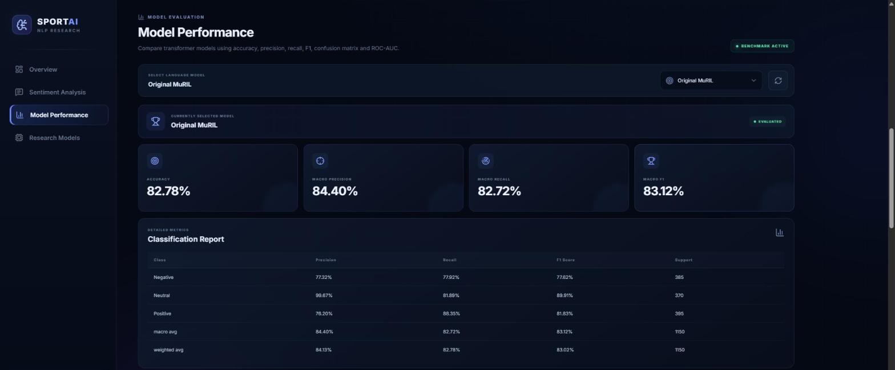
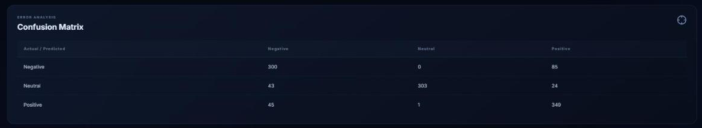
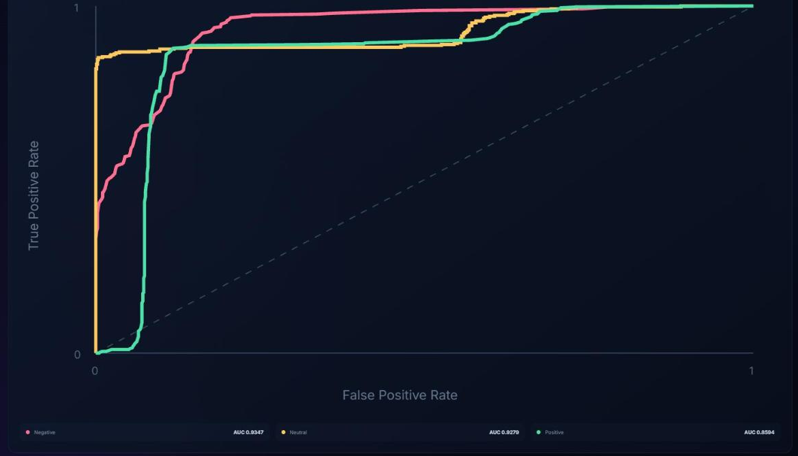
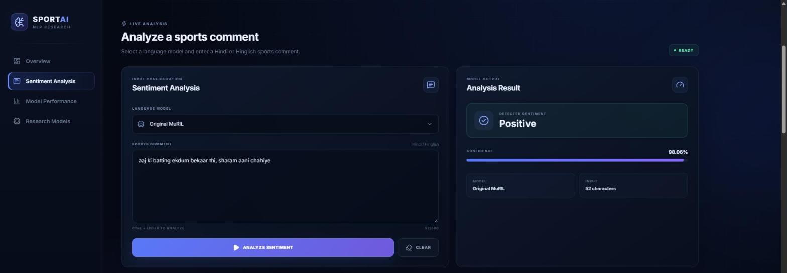

# 🏏 Hindi Sports Sentiment Analyzer

A full-stack NLP application that classifies **Hindi sports comments** as **Positive**, **Neutral**, or **Negative**, and compares several fine-tuned multilingual transformer models on the same task.

- **Frontend:** React + Vite dashboard for live analysis, model selection, and model evaluation
- **Backend:** FastAPI service that loads the selected model and serves predictions and evaluation metrics
- **Models:** MuRIL, IndicBERT v2, and XLM-RoBERTa, each fine-tuned for 3-class sentiment
- **Inference:** runs locally. No external AI APIs are used.

---

## ✨ Features

- **Live sentiment analysis** of Hindi sports comments, returning the label and a confidence score
- **Model selector** to run the same input through different transformer models
- **Model evaluation dashboard** showing accuracy, macro precision, recall and F1, confusion matrix, and ROC curves with AUC
- **Research models overview** comparing the integrated architectures
- **One model in memory at a time.** The backend unloads the previous model before loading a new one, to save RAM/VRAM.
- GPU is used automatically when available (CUDA), with CPU fallback

---

## 📸 Screenshots

### Dashboard


### Live Sentiment Analysis

| Positive | Negative | Neutral |
|---|---|---|
|  |  |  |

### Model Evaluation Dashboard







### Research Models


---

## 🤖 Models

| UI name | Model ID (API) | Base model | Weights path |
|---|---|---|---|
| Original MuRIL | `old_muril` | `google/muril-base-cased` | `model/muril_sentiment_model` (falls back to `research/muril/best_model`) |
| Research MuRIL | `research_muril` | `google/muril-base-cased` | `research/muril/best_model` |
| IndicBERT v2 | `indicbert_v2` | IndicBERT v2 | `research/indicbert_v2/best_model` |
| XLM-RoBERTa | `xlm_roberta` | `FacebookAI/xlm-roberta-base` | `research/xlm_roberta/best_model` |

> **Note:** The original MuRIL weights (`model/muril_sentiment_model`) are not included in this repository. When that folder is missing, **`old_muril` loads the Research MuRIL weights**, so both MuRIL options return identical predictions.

Model weights (`model.safetensors`, about 1 GB each) are stored with **Git LFS**.

**Label mapping**

| ID | Label |
|---|---|
| 0 | Negative |
| 1 | Neutral |
| 2 | Positive |

---

## 📂 Dataset

The current research models are trained on `dataset/NLP_Project_Final_Dataset.csv`.

| Property | Value |
|---|---|
| Total samples | 10,000 |
| Split | 80% train / 10% validation / 10% test |
| Files | `final_train.csv` (8,000), `final_validation.csv` (1,000), `final_test.csv` (1,000) |
| Columns | `text`, `sentiment` (Hindi label), `sport`, `label` (0/1/2) |
| Sports | Cricket, Football, Kabaddi, Badminton, Formula One (roughly balanced) |
| Class balance | Balanced (test set: 334 / 333 / 333) |
| Script | Devanagari Hindi |

Older datasets used in earlier project stages (`SentiHin`-based `combined_dataset.csv`, `sports_dataset.csv`, `Research_12000.csv`) are kept in `dataset/` for reference.

---

## ⚙️ Pipeline

```text
User enters a Hindi sports comment (React UI)
        │
        ▼
POST /predict  { text, model }        (FastAPI)
        │
        ▼
Load selected model + tokenizer (cached; previous model unloaded)
        │
        ▼
Tokenization  (max_length = 128, truncation)
        │
        ▼
Transformer forward pass → softmax
        │
        ▼
Sentiment (Negative / Neutral / Positive) + confidence %
```

`backend/preprocess.py` provides a text-cleaning function that removes URLs, HTML tags, @mentions, and extra whitespace. At inference time, the API passes the input text straight to the model's tokenizer.

---

## 📊 Results

Results on the held-out test split (1,000 samples), from `research/results/`:

| Model | Accuracy | Macro Precision | Macro Recall | Macro F1 |
|---|---|---|---|---|
| Research MuRIL | 1.0000 | 1.0000 | 1.0000 | 1.0000 |
| IndicBERT v2 | 1.0000 | 1.0000 | 1.0000 | 1.0000 |
| XLM-RoBERTa | 0.9990 | 0.9990 | 0.9990 | 0.9990 |

### ⚠️ How to read these numbers

Near-perfect scores here **do not mean the models will be near-perfect on real-world sports comments.** An analysis of the dataset shows:

- **No exact duplicates** between the train and test sets.
- The sentences follow **repeated clause templates**. Every test sentence shares at least one clause with the training set, and **628 of 1,000 test sentences are built entirely from clauses that also appear in training**.
- The whole dataset is assembled from about **142 action phrases and 75 outcome phrases**, and **each phrase always carries the same label**. For example, *"रन गति गिर गई"* is always Negative.
- **"नहीं" appears only in Negative sentences**, about 32% of them.
- **Emojis map one-to-one to labels:** 😞 appears only in Negative sentences, and 😀 👏 🏎 only in Positive ones.

So a model can reach near-perfect accuracy by memorizing about 200 phrases, without understanding the sentence. These results mainly measure performance on **in-distribution, template-style sentences**. A realistic estimate needs a test set of real, independently collected sports comments, including Romanized Hindi. That is work in progress.

### Evaluation dashboard numbers

The dashboard (`GET /evaluation/{model}`) uses different evaluation files from the table above:

- **Original MuRIL** (which currently loads the Research MuRIL weights) is evaluated on `dataset/test.csv`, 1,150 samples from the earlier dataset. It scores **82.78% accuracy and 83.12% macro-F1**, with per-class ROC-AUC of 0.93 (Negative), 0.93 (Neutral), and 0.86 (Positive). These are the numbers in the screenshots.
- The **research models** are evaluated on `Research_12000.csv`.

The drop from about 100% to about 83% on a different dataset is consistent with the template effect described above.

---

## 📁 Project Structure

```text
NLP-Project/
├── backend/
│   ├── main.py               # FastAPI app (multi-model prediction + evaluation API)
│   ├── model_loader.py       # Model paths, loading/unloading, prediction
│   ├── evaluation.py         # Evaluation helpers
│   ├── preprocess.py         # Text cleaning
│   ├── train_model.py        # Original MuRIL training script
│   └── ...                   # Dataset download / tokenization / test scripts
├── frontend/
│   └── src/
│       ├── App.jsx           # Dashboard: overview, live analysis, research models
│       └── ModelEvaluation.jsx  # Metrics, confusion matrix, ROC curves
├── research/
│   ├── muril/                # train_muril.py + best_model/
│   ├── indicbert_v2/         # train_indicbert_v2.py + best_model/
│   ├── xlm_roberta/          # train_xlm_roberta.py + best_model/
│   └── results/              # Test-set metrics for each model
├── dataset/                  # CSV datasets and train/val/test splits
├── screenshots/              # README images
├── app.py                    # Legacy single-model API (MuRIL only)
└── README.md
```

---

## 🚀 Run Locally (Windows PowerShell)

### Prerequisites

- Python 3.10+
- Node.js 18+
- Git and **Git LFS** (`git lfs install`). Without Git LFS you get pointer files instead of model weights.

### 1. Clone

```powershell
git lfs install
git clone https://github.com/Swen14/Hindi-Sports-Sentiment-Analyzer.git
cd Hindi-Sports-Sentiment-Analyzer
```

### 2. Backend

Run these from the **project root**, not from inside `backend/`:

```powershell
python -m venv venv
.\venv\Scripts\Activate.ps1
pip install fastapi uvicorn torch transformers scikit-learn pandas numpy sentencepiece
uvicorn backend.main:app --reload
```

- API: `http://127.0.0.1:8000`
- Interactive docs: `http://127.0.0.1:8000/docs`

> The backend uses a relative import (`from .model_loader import ...`), so start it as `backend.main:app` from the project root.

### 3. Frontend

Open a second terminal:

```powershell
cd frontend
npm install
npm run dev
```

- UI: `http://localhost:5173`

---

## 📡 API

| Method | Endpoint | Description |
|---|---|---|
| GET | `/` | API info, available models, label map |
| GET | `/models` | List of selectable models |
| GET | `/health` | Health check |
| POST | `/predict` | Predict sentiment for a text with a chosen model |
| GET | `/evaluation/{model_name}` | Metrics, confusion matrix, and ROC data for a model |

### `POST /predict`

**Request**

```json
{
  "text": "भारतीय टीम ने शानदार जीत हासिल की।",
  "model": "research_muril"
}
```

`model` is optional and defaults to `old_muril`.

**Response format**

```json
{
  "sentiment": "Positive",
  "confidence": 97.42,
  "model": "research_muril"
}
```

`confidence` is a percentage (0–100). The values above show the shape of the response, not a recorded result.

---

## 💡 Example Inputs

| Input | Expected sentiment |
|---|---|
| भारतीय टीम ने शानदार जीत हासिल की। | Positive |
| टीम का प्रदर्शन बहुत खराब रहा। | Negative |
| मैच कल शाम सात बजे शुरू होगा। | Neutral |

---

## 🧭 Limitations & Future Work

- **Evaluation realism:** Build an independent test set of real sports comments to measure generalization (see [Results](#-results)).
- **Romanized Hindi (Hinglish):** The UI accepts it, but the training data is Devanagari, and there is no transliteration step. In manual testing, a clearly negative Romanized comment was predicted **Positive with 98% confidence**:

  
- **Sports slang:** Phrases such as *"maar di"* (meaning a big win) are not explicitly handled.
- **Original MuRIL weights** are not in the repository (see [Models](#-models)).

---

## 🛠 Tech Stack

- **Frontend:** React 19, Vite, lucide-react
- **Backend:** FastAPI, Uvicorn, Python
- **ML:** PyTorch, Hugging Face Transformers, scikit-learn, pandas, NumPy
- **Tooling:** Git, GitHub, Git LFS

---

## 👨‍💻 Author

**Swen Lemos**<br>
B.Tech, Computer Science Engineering<br>
St. Francis Institute of Technology, Mumbai
