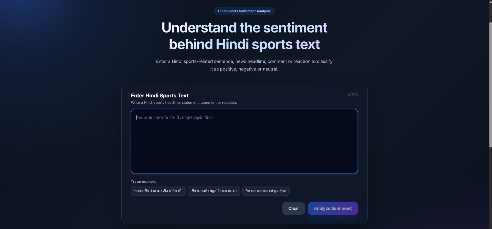
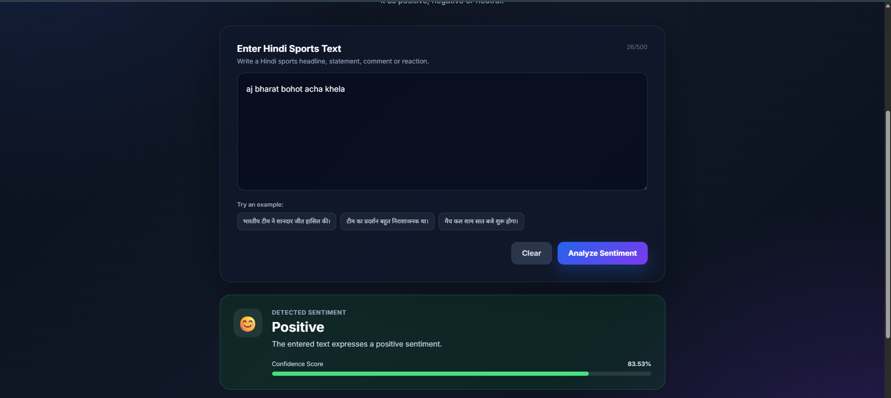
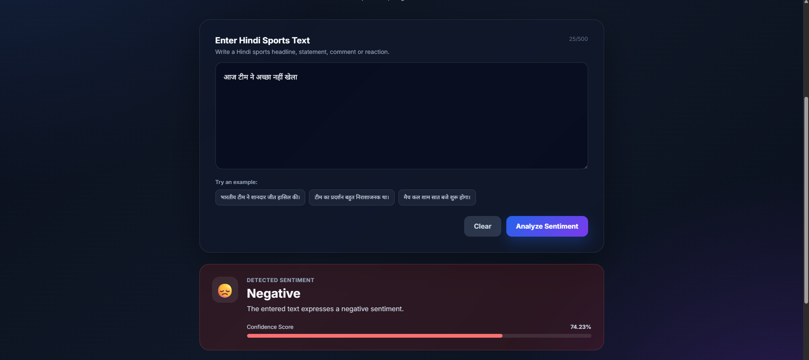
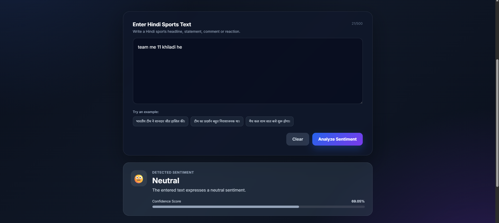

# 🏏 Hindi Sports Sentiment Analyzer using MuRIL

A web-based **Natural Language Processing (NLP)** application that analyzes **Hindi sports-related text** and classifies its sentiment as **Positive**, **Negative**, or **Neutral** using a fine-tuned **MuRIL (Multilingual Representations for Indian Languages)** transformer model.

The application features a modern frontend built with **Vite + Preact** and a **FastAPI** backend serving the fine-tuned model for real-time sentiment prediction.

---

# 📌 Project Overview

Sentiment analysis for Indian languages remains more challenging than English due to limited high-quality datasets and linguistic diversity. This project focuses specifically on **Hindi sports content**, enabling users to analyze news headlines, match reactions, and sports-related comments.

Instead of using external AI APIs, the application performs inference locally using a fine-tuned MuRIL model.

---

# ✨ Features

- Analyze Hindi sports-related text
- Classify sentiment into:
  - 😊 Positive
  - 😐 Neutral
  - 😞 Negative
- Fine-tuned MuRIL transformer model
- FastAPI backend
- Modern responsive interface built with Vite + Preact
- Confidence score for predictions
- Example Hindi sports sentences
- Clean and intuitive user interface

---

# 🛠 Tech Stack

## Frontend

- Vite
- Preact
- JavaScript
- HTML5
- CSS3

## Backend

- FastAPI
- Python
- Uvicorn

## Machine Learning

- PyTorch
- Hugging Face Transformers
- MuRIL (`google/muril-base-cased`)
- Scikit-learn
- Pandas
- NumPy

## Version Control

- Git
- GitHub

---

# 🤖 Model

Base Model

```text
google/muril-base-cased
```

The model has been fine-tuned for three sentiment classes:

- Positive
- Neutral
- Negative

---

# 📂 Dataset

The model is trained using two datasets:

- **SentiHin-2500** – Public Hindi sentiment dataset.
- **Custom Hindi Sports Sentiment Dataset** – A manually created dataset containing Hindi sports-related sentences labeled as Positive, Negative, and Neutral to improve domain-specific performance.

Both datasets are cleaned, preprocessed, and combined before fine-tuning the MuRIL model.

---

# ⚙️ Project Workflow

```text
User enters Hindi sports text
        │
        ▼
Frontend (Vite + Preact)
        │
        ▼
FastAPI Backend
        │
        ▼
MuRIL Tokenizer
        │
        ▼
Fine-tuned MuRIL Model
        │
        ▼
Sentiment Prediction
        │
        ▼
Positive / Neutral / Negative + Confidence Score
```

---

# 📁 Project Structure

```text
Hindi-Sports-Sentiment-Analyzer/
│
├── frontend/
├── backend/
├── dataset/
├── model/
├── screenshots/
├── README.md
└── .gitignore
```

---

# 🚀 Installation

## Clone Repository

```bash
git clone https://github.com/Swen14/Hindi-Sports-Sentiment-Analyzer.git
```

```bash
cd Hindi-Sports-Sentiment-Analyzer
```

## Backend

```bash
python -m venv venv
```

Activate (Windows)

```bash
venv\Scripts\activate
```

Install dependencies

```bash
pip install -r requirements.txt
```

Run FastAPI

```bash
uvicorn app:app --reload
```

Backend

```text
http://127.0.0.1:8000
```

API Documentation

```text
http://127.0.0.1:8000/docs
```

---

## Frontend

```bash
cd frontend
```

```bash
npm install
```

```bash
npm run dev
```

Frontend

```text
http://localhost:5173
```

---

# 📡 API

## POST `/predict`

### Example Request

```json
{
  "text": "भारतीय टीम ने शानदार प्रदर्शन किया।"
}
```

### Example Response

```json
{
  "sentiment": "Positive",
  "confidence": 0.94
}
```

---

# 💡 Example Predictions

| Input | Prediction |
|--------|------------|
| भारतीय टीम ने शानदार जीत हासिल की। | Positive |
| टीम का प्रदर्शन बहुत खराब रहा। | Negative |
| मैच कल शाम सात बजे शुरू होगा। | Neutral |

---

# 📸 Screenshots

## Home Page



---

## Positive Prediction



---

## Negative Prediction



---

## Neutral Prediction



---

# 👨‍💻 Author

**Swen Lemos**

B.E. Computer Science Engineering

St. Francis Institute of Technology, Mumbai
