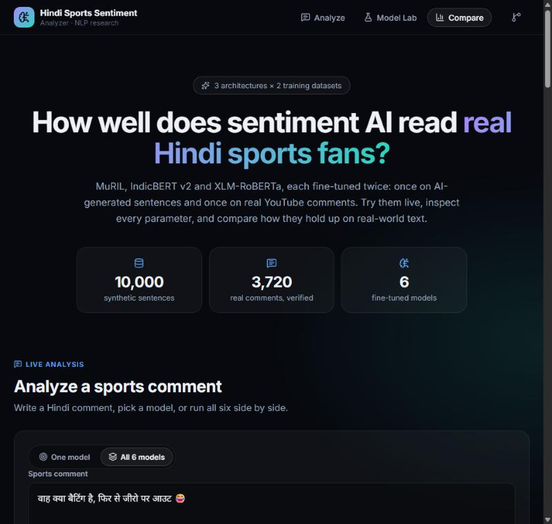
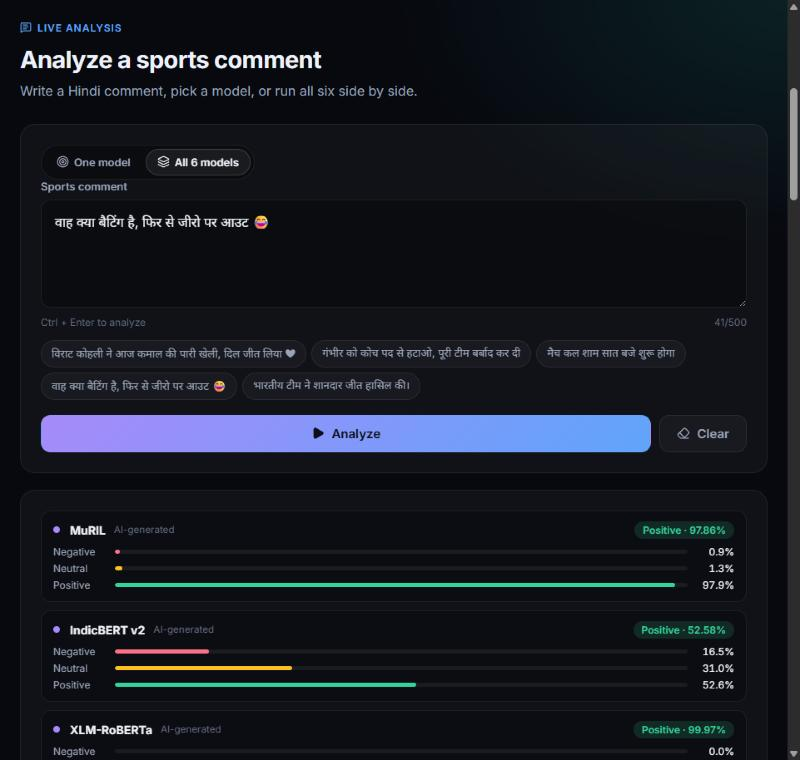
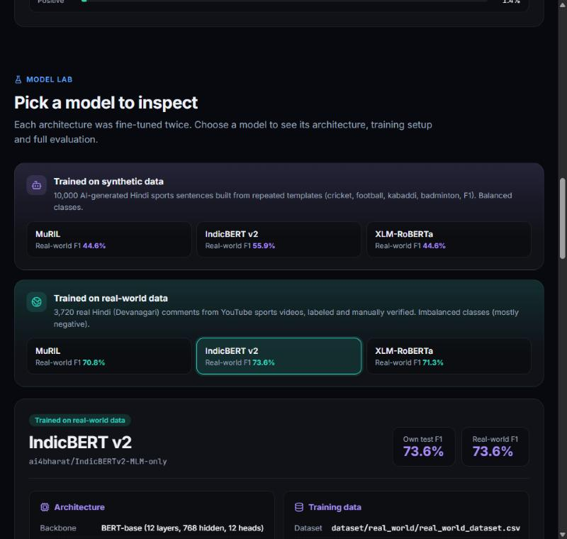
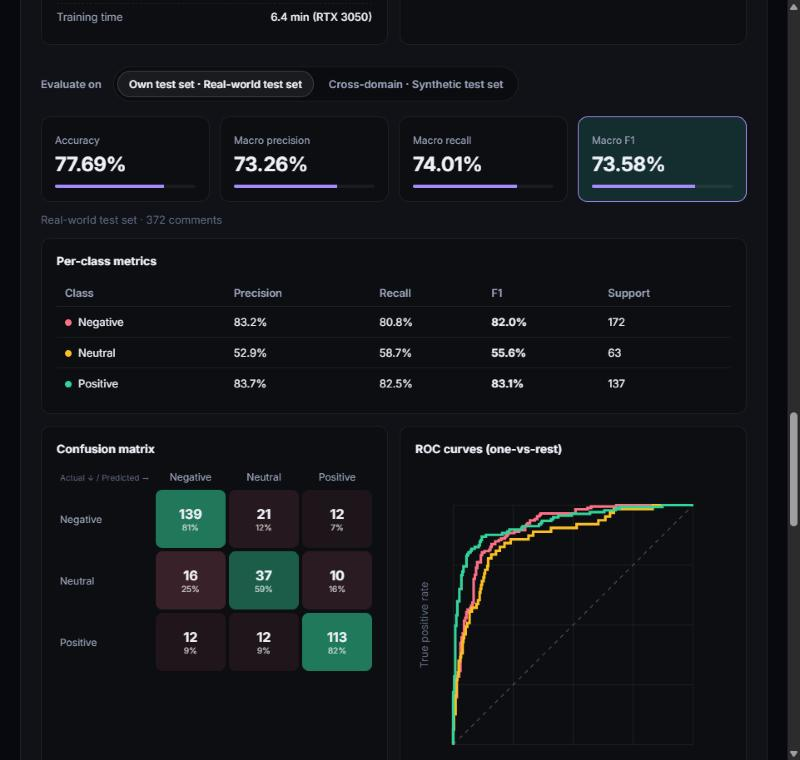
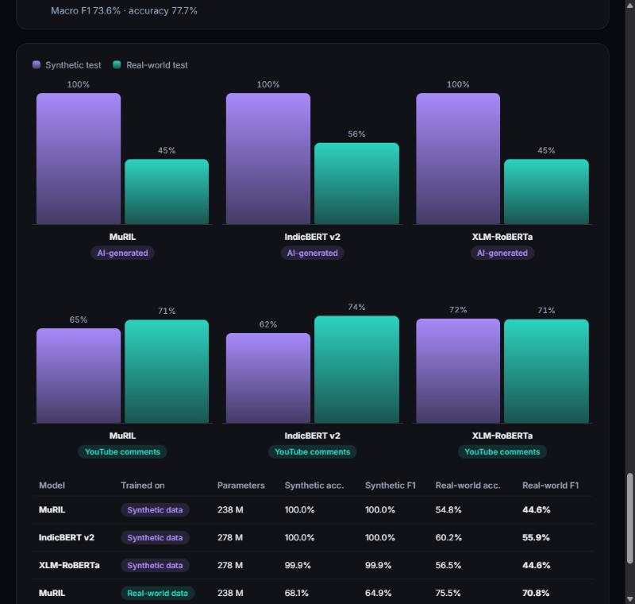

# 🏏 Hindi Sports Sentiment Analyzer

A full-stack NLP application that classifies **Hindi sports comments** as **Positive**, **Neutral**, or **Negative**. It compares three multilingual transformer architectures, each fine-tuned **twice**: once on **synthetic (AI-generated) data** and once on **real-world YouTube comments**.

- **Frontend:** React + Vite. Live analysis, a model lab to inspect every model and its parameters, and a side-by-side comparison
- **Backend:** FastAPI service that loads the selected model and serves predictions and cached evaluation metrics
- **Models:** MuRIL, IndicBERT v2, and XLM-RoBERTa × 2 training datasets = **6 fine-tuned models**
- **Inference:** runs locally. No external AI APIs are used.

---

## ✨ Features

- **Live sentiment analysis** with label, confidence and per-class probabilities
- **Run all 6 models at once** on the same comment to see where synthetic-data and real-data models disagree
- **Model lab:** pick any of the 6 models, grouped by training data, and see the architecture, parameter count, training data, hyperparameters, validation history, and full evaluation
- **Cross-domain evaluation:** test every model on its own test set *and* on the other dataset's test set
- **Evaluation details:** accuracy, macro precision / recall / F1, per-class metrics, confusion matrix and ROC curves with AUC
- **Comparison view:** macro F1 of all 6 models on both test sets
- **One model in memory at a time.** The backend unloads the previous model before loading the next, to save RAM/VRAM. GPU is used automatically (CUDA), with CPU fallback.

---

## 📸 Screenshots

### Overview



### Live analysis: all 6 models on a sarcastic comment

The comment *"वाह क्या बैटिंग है, फिर से जीरो पर आउट 😂"* ("What batting, out for zero again 😂") is sarcastic. All three synthetic-data models predict **Positive**; all three real-data models correctly predict **Negative**.



### Model lab





### Comparison



---

## 🤖 Models

| Model ID (API) | Architecture | Base model | Trained on | Weights path |
|---|---|---|---|---|
| `research_muril` | MuRIL | `google/muril-base-cased` | Synthetic | `research/muril/best_model` |
| `indicbert_v2` | IndicBERT v2 | `ai4bharat/IndicBERTv2-MLM-only` | Synthetic | `research/indicbert_v2/best_model` |
| `xlm_roberta` | XLM-RoBERTa | `FacebookAI/xlm-roberta-base` | Synthetic | `research/xlm_roberta/best_model` |
| `real_muril` | MuRIL | `google/muril-base-cased` | Real-world | `research/real_world/muril/best_model` |
| `real_indicbert_v2` | IndicBERT v2 | `ai4bharat/IndicBERTv2-MLM-only` | Real-world | `research/real_world/indicbert_v2/best_model` |
| `real_xlm_roberta` | XLM-RoBERTa | `FacebookAI/xlm-roberta-base` | Real-world | `research/real_world/xlm_roberta/best_model` |

All model metadata (architecture, hyperparameters, dataset sizes) lives in `backend/model_registry.py`. Model weights (`model.safetensors`, about 1 GB each) are stored with **Git LFS**.

> The legacy API ID `old_muril` still works and loads the synthetic MuRIL weights, but it is no longer shown in the UI.

**Label mapping:** `0` = Negative, `1` = Neutral, `2` = Positive

### Training setup

| | Synthetic models | Real-world models |
|---|---|---|
| Epochs | 3 | 5 (smaller dataset) |
| Learning rate | 2e-5 | 2e-5 |
| Batch size (train / eval) | 8 / 16 | 8 / 16 |
| Weight decay | 0.01 | 0.01 |
| Max sequence length | 128 | 128 |
| Optimizer | AdamW, linear decay, fp16 | AdamW, linear decay, fp16 |
| Model selection | Best validation macro F1 | Best validation macro F1 |

Real-world training took about 6–7 minutes per model on an RTX 3050 (6 GB).

---

## 📂 Datasets

### Synthetic dataset

`dataset/NLP_Project_Final_Dataset.csv`: 10,000 AI-generated Devanagari sentences (cricket, football, kabaddi, badminton, Formula One), balanced classes, split 8,000 / 1,000 / 1,000 (`final_train.csv`, `final_validation.csv`, `final_test.csv`).

The sentences are built from repeated templates: about **142 action phrases and 75 outcome phrases**, and **each phrase always carries the same label**. 628 of the 1,000 test sentences consist entirely of clauses that also appear in training. Emojis and "नहीं" also map almost one-to-one to labels.

### Real-world dataset

`dataset/real_world/`: **3,720 real Hindi (Devanagari) comments** from 171 YouTube sports videos (cricket, kabaddi, hockey, wrestling, athletics, badminton, football), collected with the official YouTube Data API v3.

| Property | Value |
|---|---|
| Collected | 4,074 Hindi comments (usernames not stored) |
| Labeled | Positive / Negative / Neutral / Spam, then manually verified |
| After removing spam | 3,720 comments |
| Split (stratified) | 2,976 train / 372 validation / 372 test |
| Class balance | 46% Negative, 37% Positive, 17% Neutral |

Labeling rules: praise and celebration → Positive. Criticism, abuse, and taunts at opponents → Negative. "Who's watching in 2026", facts and questions → Neutral. Off-topic, promotional and non-Hindi comments → Spam (removed).

> **Comment text is not included in this repository.** YouTube's terms don't allow republishing comment text in bulk, so the repo only contains `dataset/real_world/real_world_labels.csv` (comment ID, video ID, topic, label, split). Rebuild the full dataset with your own API key:
>
> ```powershell
> $env:YT_API_KEY = "YOUR_KEY"
> python data_collection\rebuild_real_world_dataset.py
> ```
>
> Comments deleted since collection are skipped.

---

## 📊 Results

Every model is evaluated on **both** test sets (`research/evaluate_all.py`). Macro F1 weights the three classes equally.

| Model | Trained on | Synthetic test acc. | Synthetic test F1 | Real-world test acc. | Real-world test F1 |
|---|---|---|---|---|---|
| MuRIL | Synthetic | 100.0% | 100.0% | 54.8% | 44.6% |
| IndicBERT v2 | Synthetic | 100.0% | 100.0% | 60.2% | 55.9% |
| XLM-RoBERTa | Synthetic | 99.9% | 99.9% | 56.5% | 44.6% |
| MuRIL | Real-world | 68.1% | 64.9% | 75.5% | 70.8% |
| **IndicBERT v2** | **Real-world** | 62.6% | 61.8% | **77.7%** | **73.6%** |
| XLM-RoBERTa | Real-world | 72.7% | 72.0% | 76.1% | 71.3% |

### Key findings

1. **The synthetic test score is misleading.** Models trained on synthetic data score ~100% on their own test set but only **44.6–55.9% macro F1** on real comments. They learned the templates, not sentiment.
2. **Real data generalizes better.** Models trained on 2,976 real comments reach **70.8–73.6% macro F1** on real comments, and still **61.8–72.0%** on the synthetic test set they never saw.
3. **Best real-world model: IndicBERT v2 (real-world data)**, 77.7% accuracy and 73.6% macro F1.
4. **Neutral is the hardest class** (F1 ≈ 0.56 for the best model): it is the smallest class, and many "neutral" comments carry mild emotion.
5. **Sarcasm** breaks the synthetic models (see the screenshot above), while the real-data models handle common sarcastic patterns.

Full reports: `research/results/*_results.txt` (classification reports, confusion matrices) and `research/results/evaluation/*.json` (cached metrics and ROC data used by the UI).

---

## ⚙️ Pipeline

```text
User enters a Hindi sports comment (React UI)
        │
        ▼
POST /predict  { text, model }        (FastAPI)
        │
        ▼
Load selected model + tokenizer (cached; previous model unloaded)
        │
        ▼
Tokenization (max_length = 128, truncation)
        │
        ▼
Transformer forward pass → softmax
        │
        ▼
Sentiment (Negative / Neutral / Positive) + confidence + class probabilities
```

---

## 📁 Project Structure

```text
NLP-Project/
├── backend/
│   ├── main.py               # FastAPI app (models, prediction, evaluation)
│   ├── model_registry.py     # The 6 models: paths, architecture, training metadata
│   ├── model_loader.py       # Loading/unloading models, prediction
│   ├── benchmark.py          # Evaluation on a test set + JSON cache
│   └── ...                   # Older preprocessing / training utilities
├── frontend/src/
│   ├── App.jsx               # Layout, navigation, hero
│   ├── api.js                # API client
│   └── components/           # LiveAnalysis, ModelLab, ModelPicker, EvaluationView, Comparison
├── research/
│   ├── muril/ indicbert_v2/ xlm_roberta/     # Synthetic-data training scripts + weights
│   ├── real_world/
│   │   ├── train_real_world.py               # Trains all 3 models on real-world data
│   │   └── muril/ indicbert_v2/ xlm_roberta/ # Weights + training_info.json
│   ├── evaluate_all.py       # Evaluates all 6 models on both test sets
│   └── results/              # Text reports + evaluation/*.json cache
├── data_collection/          # YouTube collection, labeling sheets, dataset rebuild
├── dataset/                  # Synthetic CSVs + real_world/ (labels only in the repo)
└── screenshots/
```

---

## 🚀 Run Locally (Windows PowerShell)

### Prerequisites

- Python 3.10+
- Node.js 18+
- Git and **Git LFS** (`git lfs install`). Without Git LFS you get pointer files instead of model weights.

### 1. Clone

```powershell
git lfs install
git clone https://github.com/Swen14/Hindi-Sports-Sentiment-Analyzer.git
cd Hindi-Sports-Sentiment-Analyzer
```

### 2. Backend

Run these from the **project root**:

```powershell
python -m venv venv
.\venv\Scripts\Activate.ps1
pip install fastapi uvicorn torch transformers scikit-learn pandas numpy sentencepiece
uvicorn backend.main:app --reload
```

- API: `http://127.0.0.1:8000`
- Interactive docs: `http://127.0.0.1:8000/docs`

### 3. Frontend

```powershell
cd frontend
npm install
npm run dev
```

- UI: `http://localhost:5173`
- The API address can be changed with `VITE_API_BASE` in `frontend/.env`.

### 4. Retrain and re-evaluate (optional)

```powershell
# needs dataset/real_world/real_*.csv (see "Real-world dataset")
python research\real_world\train_real_world.py --model all
python research\evaluate_all.py
```

---

## 📡 API

| Method | Endpoint | Description |
|---|---|---|
| GET | `/` | API info, model IDs, label map |
| GET | `/health` | Health check and models whose weights are present |
| GET | `/models` | All 6 models with architecture, training parameters and scores, plus dataset groups and test sets |
| GET | `/models/{model_id}` | One model's details |
| POST | `/predict` | Predict sentiment for a text with a chosen model |
| GET | `/evaluation/{model_id}?test_set=own\|synthetic\|real` | Metrics, confusion matrix and ROC data (cached) |

### `POST /predict`

```json
{ "text": "भारतीय टीम ने शानदार जीत हासिल की।", "model": "real_indicbert_v2" }
```

`model` is optional and defaults to `real_muril`. Response format (values are illustrative):

```json
{
  "sentiment": "Positive",
  "confidence": 97.42,
  "probabilities": { "Negative": 1.2, "Neutral": 1.38, "Positive": 97.42 },
  "model": "real_indicbert_v2"
}
```

---

## 🧭 Limitations & Future Work

- **Dataset size:** 3,720 real comments from one platform. More data, especially for the Neutral class, would help.
- **Single annotation pass:** labels were assigned once and manually verified, without a second independent annotator, so inter-annotator agreement was not measured.
- **Romanized Hindi (Hinglish):** most YouTube comments are Hinglish, but both datasets are Devanagari-only. In earlier testing, a clearly negative Romanized comment was predicted **Positive with 98% confidence**:

  
- **Topic skew:** most real comments are about cricket.
- **Taunts at opponents** are labeled Negative. Another labeling scheme could treat them as positive pride.

---

## 🛠 Tech Stack

- **Frontend:** React 19, Vite, lucide-react
- **Backend:** FastAPI, Uvicorn, Python
- **ML:** PyTorch, Hugging Face Transformers, scikit-learn, pandas, NumPy
- **Data:** YouTube Data API v3
- **Tooling:** Git, GitHub, Git LFS

---

## 👨‍💻 Author

**Swen Lemos**<br>
B.Tech, Computer Science Engineering<br>
St. Francis Institute of Technology, Mumbai
